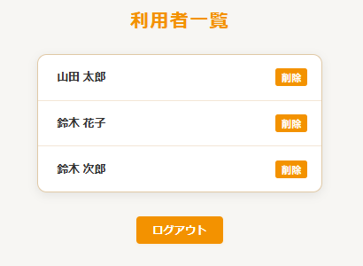
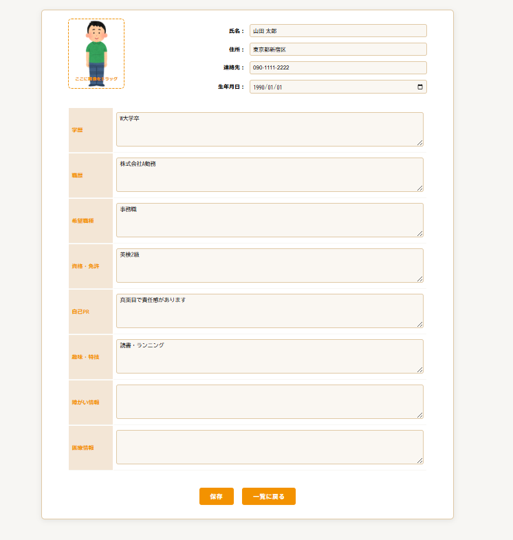

# Name

ProfileSheet

# DEMO

本アプリは、利用者のプロフィール情報をWeb上で管理・閲覧できるシステムです。  
下記は利用者一覧・プロフィール詳細画面のイメージです。




# Features

- 利用者のプロフィール（氏名・住所・連絡先・学歴・職歴など）を一元管理
- 画像（顔写真）アップロード・プレビュー機能
- 利用者情報の新規登録・編集・削除
- ログイン認証機能
- シンプルで見やすいUI（ジョブリッジ風デザイン）

# Requirement

本アプリを動かすために必要な環境・ライブラリ

* Java 21 以上
* Eclipse 2024 以降
* Apache Tomcat 10 以降
* H2 Database 2.x
* JSTL 1.2

# Installation

1. このリポジトリをクローン
    ```bash
    git clone https://github.com/mori1252/ProfileSheet.git
    ```
2. Eclipseでプロジェクトをインポート
3. 必要なライブラリ（H2, JSTLなど）をビルドパスに追加
4. Tomcatサーバーにデプロイ

# Usage

1. Tomcatサーバーを起動
2. ブラウザで `http://localhost:8080/ProfileSheet/` にアクセス
3. ログイン後(ID=999,パスワード=adminPass)、利用者一覧やプロフィール編集などの機能を利用

# Note

- サンプルID・パスワードは初期設定用です。運用時は必ず変更してください。
- 本アプリは学習・社内利用を想定しています。個人情報の取り扱いには十分ご注意ください。
- データベース（H2）は初期状態で組み込みモードです。運用環境では適切な設定を行ってください。
- サーバーやライブラリのバージョンによっては動作しない場合があります。
- 「社外秘」情報を含むため、無断での再配布・公開は禁止です。

# Author

* 作成者: mori1252

# License
- ProfileSheet is under [MIT license](https://opensource.org/licenses/MIT).

- 「社外秘」

- profile is Confidential.