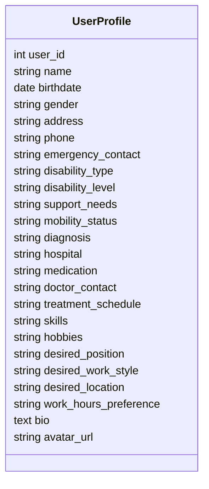

```mermaid
classDiagram
    class UserProfile {
        int     user_id
        string  name
        date    birthdate
        string  gender
        string  address
        string  phone
        string  emergency_contact
        string  disability_type
        string  disability_level
        string  support_needs
        string  mobility_status
        string  diagnosis
        string  hospital
        string  medication
        string  doctor_contact
        string  treatment_schedule
        string  skills
        string  hobbies
        string  desired_position
        string  desired_work_style
        string  desired_location
        string  work_hours_preference
        text    bio
        string  avatar_url
    }
```
